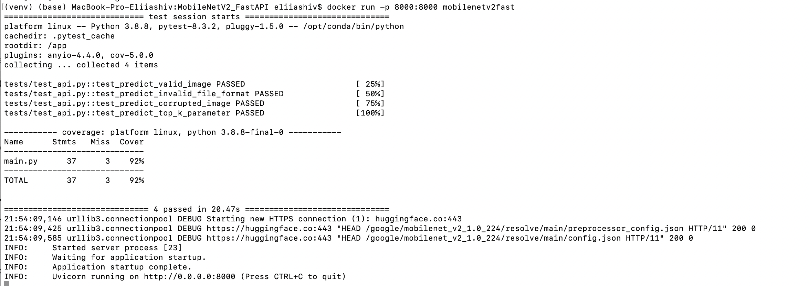
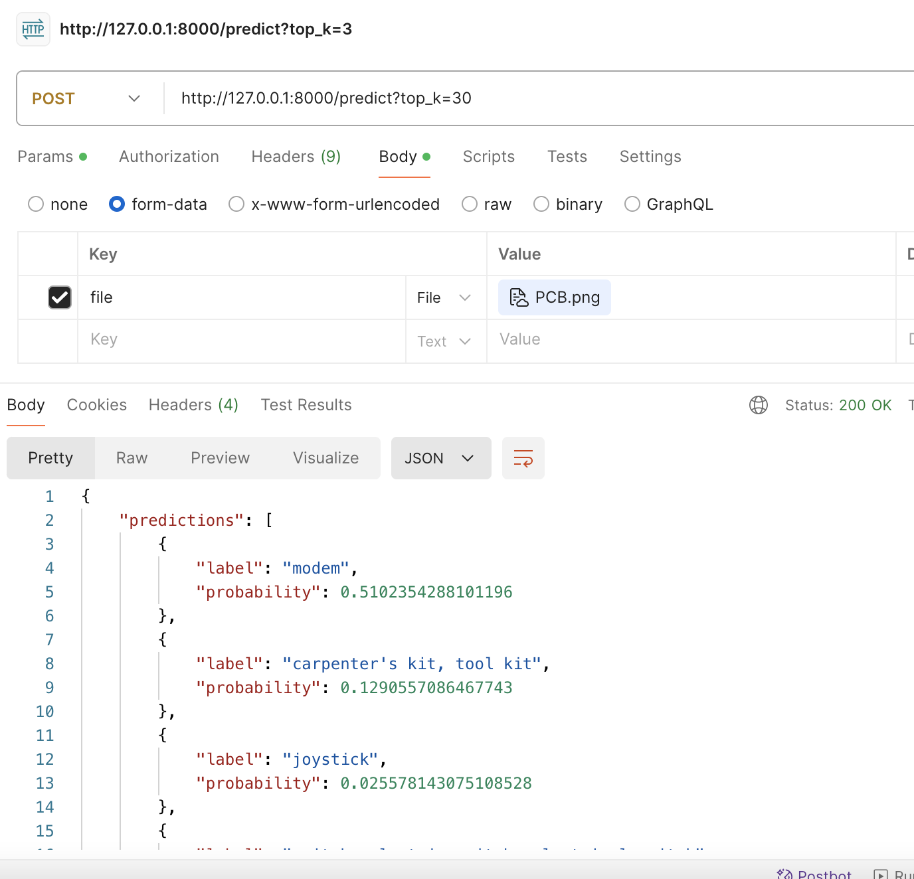

# MobileNetV2 FastAPI Dockerized
This project provides a Dockerized FastAPI application that uses a pre-trained MobileNetV2 model for image classification. 
Follow the instructions below to set up and run the application using Docker.
## Setup
### 1. Build the Docker Image

First, you need to build the Docker image.
Run the following command in the root directory of the project where the `Dockerfile` is located:

```bash
docker build -t mobilenetv2fast .
```
### 2. Run the Docker Container

Once the image is built, you can run the Docker container. 
The following command will run the container and expose the application on port 8000:

```bash
docker run -p 8000:8000 mobilenetv2fast
```
Run container include start test with coverage report


*Coverage report*
### 3. Access the API

After running the container, the FastAPI application will be accessible at `http://localhost:8000`.

## Usage
### Uploading Images for Classification

You can use `cURL` to upload images for classification. 
Ensure you have the images in a directory named `img` in the current working directory.

#### cURL Commands
```bash
curl -X POST "http://localhost:8000/predict?top_k=3" -F "file=@img/cat.jpeg"
```

Replace `top_k=3` with the number of top predictions you want to receive.

### Example Response
The API will return a JSON response with the top predicted classes and their probabilities. Here is an example response:

```json
{
    "predictions": [
        {
            "label": "tiger cat",
            "probability": 0.5058031678199768
        },
        {
            "label": "tabby, tabby cat",
            "probability": 0.15838323533535004
        },
        {
            "label": "Egyptian cat",
            "probability": 0.0964135080575943
        }
    ]
}
```
### cURL Commands Examples
Ensure you have the images in a directory named `img` in the current working directory. Here are the `cURL` commands to upload these images to the API:

```bash
curl -X POST "http://localhost:8000/predict?top_k=3" -F "file=@img/cat.jpeg"
curl -X POST "http://localhost:8000/predict?top_k=3" -F "file=@img/egg.jpeg"
curl -X POST "http://localhost:8000/predict?top_k=3" -F "file=@img/PCB.png"
curl -X POST "http://localhost:8000/predict?top_k=3" -F "file=@img/woman.jpeg"
```

Replace `top_k=3` with the desired number of top predictions. These commands will send the images to the FastAPI application running on `localhost:8000` and receive the classification results.

You can copy curl command, import in Postman, select the image and test:

*Postman usage*